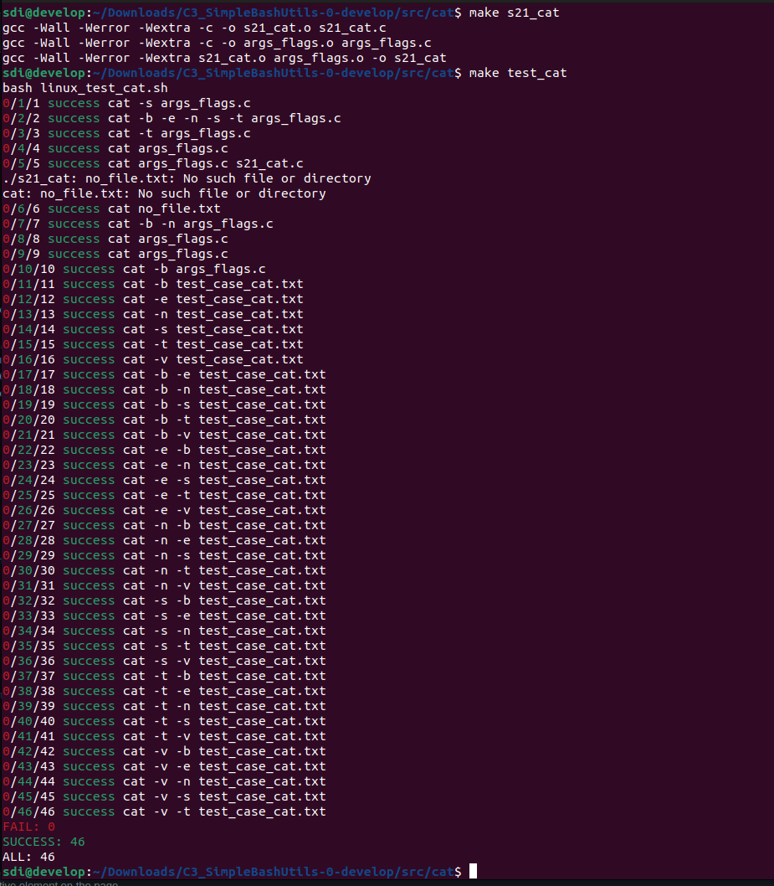

# Bash Utils "Cat" and "Grep"

Разработка утилит Bash по работе с текстом: cat, grep.

### cat

Cat - одна из наиболее часто используемых команд в Unix-подобных операционных системах. Команда имеет три взаимосвязанные функции в отношении текстовых файлов: отображение, объединение их копий и создание новых.

`cat [OPTION] [FILE]...`

| № | Опции | Описание |
| ------ | ------ | ------ |
| 1 | -b (GNU: --number-nonblank) | нумерует только непустые строки |
| 2 | -e предполагает и -v (GNU only: -E то же самое, но без применения -v) | также отображает символы конца строки как $  |
| 3 | -n (GNU: --number) | нумерует все выходные строки |
| 4 | -s (GNU: --squeeze-blank) | сжимает несколько смежных пустых строк |
| 5 | -t предполагает и -v (GNU: -T то же самое, но без применения -v) | также отображает табы как ^I |

### grep

`grep [options] template [file_name]`

| № | Опции | Описание |
| ------ | ------ | ------ |
| 1 | -e | Шаблон |
| 2 | -i | Игнорирует различия регистра.  |
| 3 | -v | Инвертирует смысл поиска соответствий. |
| 4 | -c | Выводит только количество совпадающих строк. |
| 5 | -l | Выводит только совпадающие файлы.  |
| 6 | -n | Предваряет каждую строку вывода номером строки из файла ввода. |
| 7 | -h | Выводит совпадающие строки, не предваряя их именами файлов. |
| 8 | -s | Подавляет сообщения об ошибках о несуществующих или нечитаемых файлах. |
| 9 | -f file | Получает регулярные выражения из файла. |
| 10 | -o | Печатает только совпадающие (непустые) части совпавшей строки. |

## Задача:

- Программы должны быть разработаны на языке Си стандарта C11 с использованием компилятора gcc 
- Код программ cat и grep должен находиться в папках src/cat/ и src/grep/ соответственно  
- Не использовать устаревшие и выведенные из употребления конструкции языка и библиотечные функции. Обращать внимания на пометки legacy и obsolete в официальной документации по языку и используемым библиотекам. Ориентироваться на стандарт POSIX.1-2017 
- При написании кода необходимо придерживаться Google Style
- Программы должны представлять собой исполняемый файл с аргументами командной строки
- Сборка программ должна быть настроена с помощью Makefile с соответствующими целями: s21_cat, s21_grep  
- Если используются сторонние библиотеки, в Makefile должны быть заложены сценарии сборки, предусматривающие их подключение/загрузку 
- Необходимо покрытие интеграционными тестами для всех вариантов флагов и входных значений, на базе сравнения с поведением реальных утилит Bash
- Программа должна быть разработана в соответствии с принципами структурного программирования
- Необходимо исключить дублирование кода, переиспользовать общие модули между утилитами. Общие модули можно вынести в отдельную папку src/common
- Можно использовать стандартные и нестандартные библиотеки языка Си, можно использовать собственноручно разработанные библиотеки из других проектов
- Формулировка сообщения при возникновении ошибочной ситуации не имеет значения
- Ввод через stdin обрабатывать не обязательно

## Разработка утилиты `cat`

Необходимо разработать утилиту cat:
- Поддержка всех флагов (включая GNU версии), указанных выше
- Исходные, заголовочные и сборочный файлы должны располагаться в директории src/cat/
- Итоговый исполняемый файл должен располагаться в директории src/cat/ и называться s21_cat

## Разработка утилиты `grep`

Необходимо разработать утилиту grep:
- Поддержка следующих флагов: `-e`, `-i`, `-v`, `-c`, `-l`, `-n`
- Для регулярных выражений можно использовать только библиотеки pcre или regex  
- Исходные, заголовочные и make файлы должны располагаться в директории src/grep/
- Итоговый исполняемый файл должен располагаться в директории src/grep/ и называться s21_grep

## Компиляция и запуск
Утилиты разрабатывались и тестировались в ОС **`Ubuntu desktop 22.04`**

- `cd src/cat`
- `make check` - запуск стилевых и cppcheck проверок
- `make s21_cat` - сборка утилиты
- `make test_valgrind` - проверка на утечки памяти
- `make test_cat` - запуск тестов
- `make clean` - удалить временные файлы и файлы сборки

Набор дейстивий по компиляции и запуску `grep` аналогичен

- 

